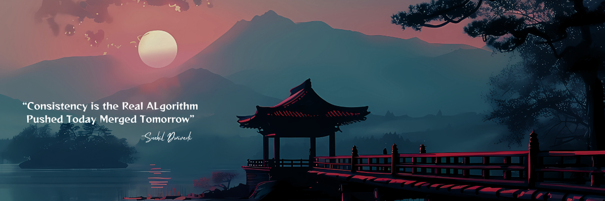

  

<!-- Typing effect gif or fallback heading -->
<h2 align="center">Hey 👋, I'm Snehil Dwivedi</h2>

  <strong>Fullstack Developer | Frontend Craftsman</strong> 
  <em>JavaScript | React | Node.js | C++</em>

---

## 🙋‍♂️ About Me

I'm **Snehil Dwivedi**, a passionate **Full-Stack Developer** from 🇮🇳  
🔭 Currently building projects in **React**, **Node.js**, and **C++**  
🎯 Preparing for **CDS** and **AFCAT 2025**  
⚡ I combine design + code to craft magical dev experiences.

---

## 💻 Tech Stack

  
  
  
  
  
  
  
  
  
  
  
  
  

---

## 📊 GitHub Stats

  

  

---

## 🎯 Goals & Aspirations

- Crack **CDS & AFCAT 2025** ✈️
- Contribute to **open-source**
- Land a **top tech internship/job**
- Build my own **React + Node.js product**
- Learn **DSA** and **System Design**

---

## 🚀 Featured Projects

| Project                                                 | Description                                   | Tech               |
| ------------------------------------------------------- | --------------------------------------------- | ------------------ |
| [Swadha Organics](https://swadha-organics.netlify.app/) | Frontend site built in 3 days                 | HTML, CSS, JS      |
| Portfolio Terminal UI                                   | OS-based themed portfolio with command system | JavaScript, Design |
| Library Management System                               | Full C++ project for concept brushing         | C++                |

---

## 🎵 Music Vibe (Click to Listen)

  

---

<!-- 🧠 Footer -->

  

