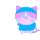

 

  

<!-- Typing effect gif or fallback heading -->
<h2 align="center">
  
   
  Hey there, I'm <strong>Snehil Dwivedi</strong>
</h2>

  Passionate Full Stack Developer | Problem Solver  
  Skilled in JavaScript, React, Node.js & C++

>

---

## 🙋‍♂️ About Me

I'm **Snehil Dwivedi** — just a regular human who thinks in `console.log()` and dreams in `while(true)` loops 😅  
💻 I build cool stuff using **JavaScript**, **React**, **Node.js**, and I’m dangerously comfortable with **C++**

🧠 When I’m not coding, you’ll find me:

- Getting lost in a game of **chess**
- Flipping through **books**
- Wandering out into **nature** for some peace and fresh ideas 🌿

🚀 Currently:

- Working on personal projects to level up my skills
- Exploring ideas to start something of my own (startup brain: always online ⚡)

🎯 Goal: Write clean, efficient code and maybe build something people can't live without one day ☕💡

## 💻 Tech Stack

  
  
  
  
  
  
  
  
  
  
  
  
  

---

## 📊 GitHub Stats

  

---

<!-- 🧠 Footer -->

  

