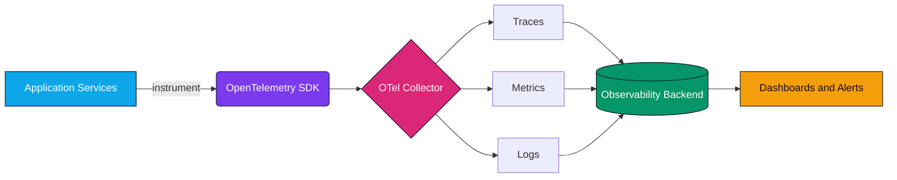
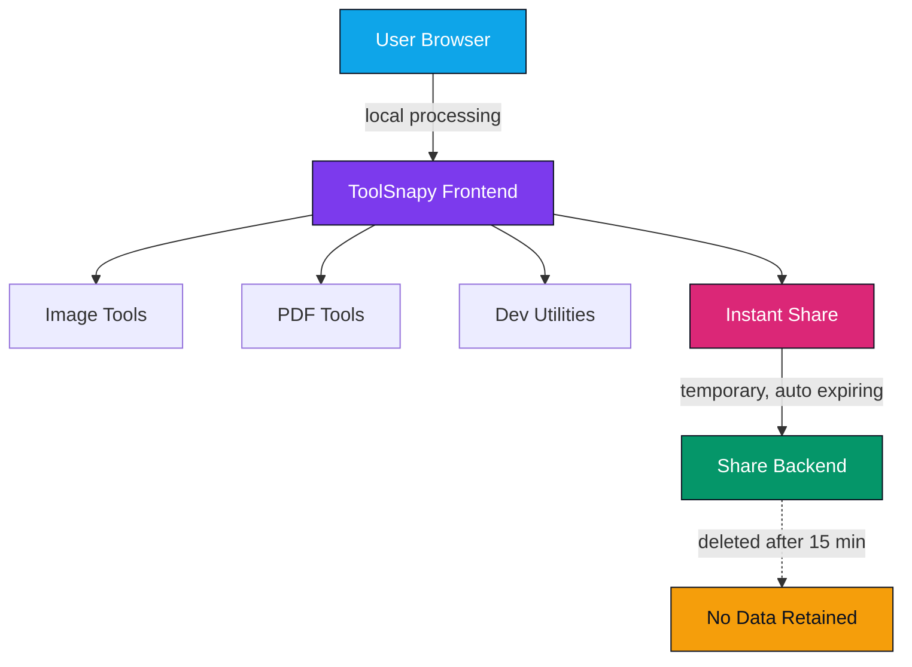

<!-- Banner -->
<p align="center">
  
</p>

<h1 align="center">Snehil Dwivedi</h1>

<p align="center">
  <a href="https://github.com/snehildwivedi03">
    
  </a>
</p>

<p align="center">
  
  
  
</p>

<p align="center">
  <a href="https://snehil-3d-portfolio.vercel.app/"></a>
  <a href="https://www.linkedin.com/"></a>
  <a href="https://github.com/snehildwivedi03"></a>
  <a href="mailto:snehildwivedi03@gmail.com"></a>
</p>

<p align="center">
  <em>Snehil Dwivedi (<code>snehildwivedi03</code>) &mdash; Full Stack Developer &amp; Jr Software Engineer at CrosslynxUS, based in India, building observability with OpenTelemetry and exploring Agentic AI.</em>
</p>

<div align="center">
  
</div>

---

## whoami

```bash
$ snehil --about
```

```yaml
name:      Snehil Dwivedi
alias:     snehildwivedi03
role:      Jr Software Engineer (SDE) @ CrosslynxUS
location:  India
building:  Observability pipelines with OpenTelemetry (OTel)
learning:  Agentic AI, distributed tracing, scalable backends
stack:     JavaScript, TypeScript, React, Node.js, C++
hobbies:   chess, reading, travelling, learning new things
mindset:   clean code, strong fundamentals, ship and iterate
```

Hi, I am **Snehil Dwivedi** &mdash; a Full Stack Developer and Junior Software Engineer (SDE) at **CrosslynxUS**, based in India. My day-to-day is telemetry and observability with **OpenTelemetry**: instrumenting services and turning raw traces, metrics, and logs into signals teams can actually trust. I love turning ideas into products that feel fast and look clean, and I am steadily going deeper into **distributed systems** and **Agentic AI** &mdash; where autonomous agents plan, call tools, and coordinate work.

You can find me online as **`snehildwivedi03`**. If you searched for *Snehil Dwivedi* or *snehildwivedi03*, welcome &mdash; you are in the right place. :wave:

---

## What I Am Working On


```mermaid
flowchart LR
    A[Application Services] -->|instrument| B(OpenTelemetry SDK)
    B --> C{OTel Collector}
    C --> D[Traces]
    C --> E[Metrics]
    C --> F[Logs]
    D --> G[(Observability Backend)]
    E --> G
    F --> G
    G --> H[Dashboards and Alerts]

    style A fill:#0EA5E9,stroke:#0B1120,color:#ffffff
    style B fill:#7C3AED,stroke:#0B1120,color:#ffffff
    style C fill:#DB2777,stroke:#0B1120,color:#ffffff
    style G fill:#059669,stroke:#0B1120,color:#ffffff
    style H fill:#F59E0B,stroke:#0B1120,color:#0B1120
```

- Instrumenting services and wiring up traces, metrics, and logs with OpenTelemetry
- Learning how distributed systems are observed, debugged, and kept reliable in production
- Exploring agentic AI patterns where autonomous agents plan, call tools, and coordinate tasks

---

## Tech Stack

<p align="left">
  
  
  
  
  
  
</p>
<p align="left">
  
  
  
  
  
</p>
<p align="left">
  
  
  
  
  
</p>

---

## Spotlight Project: ToolSnapy

> Privacy first online tools that run entirely in your browser. No tracking, no cloud uploads, no data collection.

ToolSnapy is a full stack suite of fast, free, privacy focused utilities. Files are processed locally using modern Web APIs, so user data never leaves the device. It bundles more than fifty tools across images, PDFs, text, calculators, and developer utilities, plus an instant share feature for text and files that auto deletes shared content after fifteen minutes.


```mermaid
flowchart TD
    U[User Browser] -->|local processing| T[ToolSnapy Frontend]
    T --> I[Image Tools]
    T --> P[PDF Tools]
    T --> D[Dev Utilities]
    T --> S[Instant Share]
    S -->|temporary, auto expiring| B[Share Backend]
    B -.->|deleted after 15 min| X[No Data Retained]

    style U fill:#0EA5E9,stroke:#0B1120,color:#ffffff
    style T fill:#7C3AED,stroke:#0B1120,color:#ffffff
    style S fill:#DB2777,stroke:#0B1120,color:#ffffff
    style B fill:#059669,stroke:#0B1120,color:#ffffff
    style X fill:#F59E0B,stroke:#0B1120,color:#0B1120
```

**Highlights**
- In browser image compression, background removal, format conversion, and OCR
- PDF merge, split, and conversion tools with no server side upload
- Developer utilities such as JSON formatter, hash generator, UUID, and Base64 tools
- Instant share with short codes and automatic expiry for privacy

`React` &nbsp; `TypeScript` &nbsp; `Node.js` &nbsp; `Web APIs` &nbsp; `Privacy First`

---

## More Featured Projects

<table>
  <tr>
    <td width="50%" valign="top">
      <h3>3D Portfolio</h3>
      <p>Interactive portfolio built with real time 3D and motion effects for an immersive first impression.</p>
      <p><code>React</code> <code>Three.js</code> <code>Tailwind</code></p>
      <a href="https://snehil-3d-portfolio.vercel.app/">Live Site</a>
    </td>
    <td width="50%" valign="top">
      <h3>Swadha Organics</h3>
      <p>Clean, minimal landing page for an organic product brand with a focus on clarity and conversion.</p>
      <p><code>HTML</code> <code>CSS</code> <code>JavaScript</code></p>
      <a href="https://swadha-organics.netlify.app/">Live Site</a>
    </td>
  </tr>
  <tr>
    <td width="50%" valign="top">
      <h3>JS Terminal Portfolio</h3>
      <p>Operating system themed portfolio with an interactive terminal interface for a playful experience.</p>
      <p><code>HTML</code> <code>CSS</code> <code>JavaScript</code></p>
      <a href="https://snehil-js-portfolio.netlify.app/">Live Site</a>
    </td>
    <td width="50%" valign="top">
      <h3>C++ Projects</h3>
      <p>Growing collection of C++ programs exploring object oriented design, file handling, and core logic.</p>
      <p><code>C++</code> <code>OOP</code> <code>File Handling</code></p>
      <a href="https://github.com/snehildwivedi03/Cpp-Projects">Source Code</a>
    </td>
  </tr>
</table>

---

## Beyond the Code

When I step away from the keyboard, I am usually thinking a few moves ahead.

<table>
  <tr>
    <td align="center" width="25%">&#9823;<br/><strong>Chess</strong><br/><sub>Tactics &amp; endgames</sub></td>
    <td align="center" width="25%">&#128218;<br/><strong>Reading</strong><br/><sub>Tech &amp; non-fiction</sub></td>
    <td align="center" width="25%">&#9992;&#65039;<br/><strong>Travelling</strong><br/><sub>New places &amp; people</sub></td>
    <td align="center" width="25%">&#129504;<br/><strong>Learning</strong><br/><sub>Always something new</sub></td>
  </tr>
</table>

### Play Chess With Me &#9823;

**Anyone can play me — right here on GitHub.** It's a live, shared game: you make a move, a bot validates it with a real chess engine, updates the board below, and it's the next person's turn.

<!-- CHESS:START -->
<p align="center">
  
</p>

<p align="center"><b>White to move</b> &nbsp;&middot;&nbsp; click a move, then press <b>Submit new issue</b></p>

<p align="center">
  <a href="https://github.com/snehildwivedi03/snehildwivedi03/issues/new?title=chess%7Cmove%7Ca2a3&body=Press%20%22Submit%20new%20issue%22%20to%20play%20this%20move.%20You%20do%20not%20need%20to%20change%20anything.">a3</a> &nbsp;&middot;&nbsp; <a href="https://github.com/snehildwivedi03/snehildwivedi03/issues/new?title=chess%7Cmove%7Ca2a4&body=Press%20%22Submit%20new%20issue%22%20to%20play%20this%20move.%20You%20do%20not%20need%20to%20change%20anything.">a4</a> &nbsp;&middot;&nbsp; <a href="https://github.com/snehildwivedi03/snehildwivedi03/issues/new?title=chess%7Cmove%7Cb2b3&body=Press%20%22Submit%20new%20issue%22%20to%20play%20this%20move.%20You%20do%20not%20need%20to%20change%20anything.">b3</a> &nbsp;&middot;&nbsp; <a href="https://github.com/snehildwivedi03/snehildwivedi03/issues/new?title=chess%7Cmove%7Cb2b4&body=Press%20%22Submit%20new%20issue%22%20to%20play%20this%20move.%20You%20do%20not%20need%20to%20change%20anything.">b4</a> &nbsp;&middot;&nbsp; <a href="https://github.com/snehildwivedi03/snehildwivedi03/issues/new?title=chess%7Cmove%7Cc2c3&body=Press%20%22Submit%20new%20issue%22%20to%20play%20this%20move.%20You%20do%20not%20need%20to%20change%20anything.">c3</a> &nbsp;&middot;&nbsp; <a href="https://github.com/snehildwivedi03/snehildwivedi03/issues/new?title=chess%7Cmove%7Cc2c4&body=Press%20%22Submit%20new%20issue%22%20to%20play%20this%20move.%20You%20do%20not%20need%20to%20change%20anything.">c4</a> &nbsp;&middot;&nbsp; <a href="https://github.com/snehildwivedi03/snehildwivedi03/issues/new?title=chess%7Cmove%7Cd2d3&body=Press%20%22Submit%20new%20issue%22%20to%20play%20this%20move.%20You%20do%20not%20need%20to%20change%20anything.">d3</a> &nbsp;&middot;&nbsp; <a href="https://github.com/snehildwivedi03/snehildwivedi03/issues/new?title=chess%7Cmove%7Cd2d4&body=Press%20%22Submit%20new%20issue%22%20to%20play%20this%20move.%20You%20do%20not%20need%20to%20change%20anything.">d4</a> &nbsp;&middot;&nbsp; <a href="https://github.com/snehildwivedi03/snehildwivedi03/issues/new?title=chess%7Cmove%7Ce2e3&body=Press%20%22Submit%20new%20issue%22%20to%20play%20this%20move.%20You%20do%20not%20need%20to%20change%20anything.">e3</a> &nbsp;&middot;&nbsp; <a href="https://github.com/snehildwivedi03/snehildwivedi03/issues/new?title=chess%7Cmove%7Ce2e4&body=Press%20%22Submit%20new%20issue%22%20to%20play%20this%20move.%20You%20do%20not%20need%20to%20change%20anything.">e4</a> &nbsp;&middot;&nbsp; <a href="https://github.com/snehildwivedi03/snehildwivedi03/issues/new?title=chess%7Cmove%7Cf2f3&body=Press%20%22Submit%20new%20issue%22%20to%20play%20this%20move.%20You%20do%20not%20need%20to%20change%20anything.">f3</a> &nbsp;&middot;&nbsp; <a href="https://github.com/snehildwivedi03/snehildwivedi03/issues/new?title=chess%7Cmove%7Cf2f4&body=Press%20%22Submit%20new%20issue%22%20to%20play%20this%20move.%20You%20do%20not%20need%20to%20change%20anything.">f4</a> &nbsp;&middot;&nbsp; <a href="https://github.com/snehildwivedi03/snehildwivedi03/issues/new?title=chess%7Cmove%7Cg2g3&body=Press%20%22Submit%20new%20issue%22%20to%20play%20this%20move.%20You%20do%20not%20need%20to%20change%20anything.">g3</a> &nbsp;&middot;&nbsp; <a href="https://github.com/snehildwivedi03/snehildwivedi03/issues/new?title=chess%7Cmove%7Cg2g4&body=Press%20%22Submit%20new%20issue%22%20to%20play%20this%20move.%20You%20do%20not%20need%20to%20change%20anything.">g4</a> &nbsp;&middot;&nbsp; <a href="https://github.com/snehildwivedi03/snehildwivedi03/issues/new?title=chess%7Cmove%7Ch2h3&body=Press%20%22Submit%20new%20issue%22%20to%20play%20this%20move.%20You%20do%20not%20need%20to%20change%20anything.">h3</a> &nbsp;&middot;&nbsp; <a href="https://github.com/snehildwivedi03/snehildwivedi03/issues/new?title=chess%7Cmove%7Ch2h4&body=Press%20%22Submit%20new%20issue%22%20to%20play%20this%20move.%20You%20do%20not%20need%20to%20change%20anything.">h4</a> &nbsp;&middot;&nbsp; <a href="https://github.com/snehildwivedi03/snehildwivedi03/issues/new?title=chess%7Cmove%7Cb1a3&body=Press%20%22Submit%20new%20issue%22%20to%20play%20this%20move.%20You%20do%20not%20need%20to%20change%20anything.">Na3</a> &nbsp;&middot;&nbsp; <a href="https://github.com/snehildwivedi03/snehildwivedi03/issues/new?title=chess%7Cmove%7Cb1c3&body=Press%20%22Submit%20new%20issue%22%20to%20play%20this%20move.%20You%20do%20not%20need%20to%20change%20anything.">Nc3</a> &nbsp;&middot;&nbsp; <a href="https://github.com/snehildwivedi03/snehildwivedi03/issues/new?title=chess%7Cmove%7Cg1f3&body=Press%20%22Submit%20new%20issue%22%20to%20play%20this%20move.%20You%20do%20not%20need%20to%20change%20anything.">Nf3</a> &nbsp;&middot;&nbsp; <a href="https://github.com/snehildwivedi03/snehildwivedi03/issues/new?title=chess%7Cmove%7Cg1h3&body=Press%20%22Submit%20new%20issue%22%20to%20play%20this%20move.%20You%20do%20not%20need%20to%20change%20anything.">Nh3</a>
</p>
<!-- CHESS:END -->

**How to play**

- Click any **move link** shown under the board above — each one is a legal move for the side whose turn it is.
- GitHub opens a **New issue** with your move already filled in. Just press **Submit new issue** (you need a free GitHub account and to be signed in).
- **Do not edit the issue title** — it carries your move, e.g. `chess|move|e2e4`.
- Within a few seconds a bot plays your move, updates the board here, replies to your issue, and closes it.
- **Refresh my profile** to see the new position, then make the next move. It's one open board — you and everyone else share the same game.
- When a game ends (checkmate, stalemate, or draw), click **Start a new game** under the board to reset it.

---

## Currently

- Building observability with OpenTelemetry as a Jr SDE at CrosslynxUS
- Gaining hands on experience across traces, metrics, logs, and the OTel Collector
- Exploring agentic AI, where autonomous agents plan, use tools, and coordinate tasks
- Sharpening frontend architecture and clean backend design along the way

---

<p align="center">
  
</p>

<p align="center">
  <em>Open to collaboration and interesting problems. Feel free to reach out.</em>
</p>
