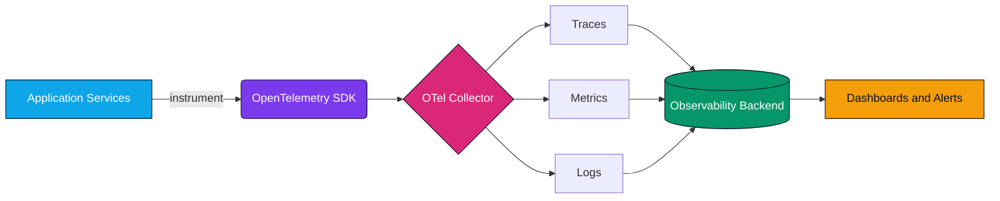
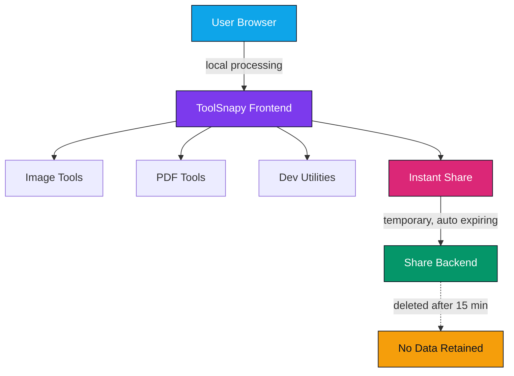

<!-- Banner -->
<p align="center">
  
</p>

<h1 align="center">Snehil Dwivedi</h1>

<p align="center">
  <a href="https://github.com/snehildwivedi03">
    
  </a>
</p>

<p align="center">
  
  
  
</p>

<p align="center">
  <a href="https://snehil-3d-portfolio.vercel.app/"></a>
  <a href="https://www.linkedin.com/"></a>
  <a href="https://github.com/snehildwivedi03"></a>
  <a href="mailto:snehildwivedi03@gmail.com"></a>
</p>

<div align="center">
  
</div>

---

## whoami

```bash
$ snehil --about
```

```yaml
name:      Snehil Dwivedi
role:      Jr Software Engineer (SDE) @ CrosslynxUS
building:  Observability pipelines with OpenTelemetry (OTel)
learning:  Agentic AI, distributed tracing, scalable backends
stack:     JavaScript, React, Node.js, C++
mindset:   clean code, strong fundamentals, ship and iterate
offline:   chess, books, and time outdoors to reset ideas
```

I am a Full Stack Developer, currently working as a Junior Software Engineer at CrosslynxUS, where my focus is telemetry and observability using OpenTelemetry. I enjoy turning ideas into products that feel fast and look clean, and I am steadily building experience across OTel instrumentation and agentic AI workflows.

---

## What I Am Working On


```mermaid
flowchart LR
    A[Application Services] -->|instrument| B(OpenTelemetry SDK)
    B --> C{OTel Collector}
    C --> D[Traces]
    C --> E[Metrics]
    C --> F[Logs]
    D --> G[(Observability Backend)]
    E --> G
    F --> G
    G --> H[Dashboards and Alerts]

    style A fill:#0EA5E9,stroke:#0B1120,color:#ffffff
    style B fill:#7C3AED,stroke:#0B1120,color:#ffffff
    style C fill:#DB2777,stroke:#0B1120,color:#ffffff
    style G fill:#059669,stroke:#0B1120,color:#ffffff
    style H fill:#F59E0B,stroke:#0B1120,color:#0B1120
```

- Instrumenting services and wiring up traces, metrics, and logs with OpenTelemetry
- Learning how distributed systems are observed, debugged, and kept reliable in production
- Exploring agentic AI patterns where autonomous agents plan, call tools, and coordinate tasks

---

## Tech Stack

<p align="left">
  
  
  
  
  
  
</p>
<p align="left">
  
  
  
  
  
</p>
<p align="left">
  
  
  
  
  
</p>

---

## Spotlight Project: ToolSnapy

> Privacy first online tools that run entirely in your browser. No tracking, no cloud uploads, no data collection.

ToolSnapy is a full stack suite of fast, free, privacy focused utilities. Files are processed locally using modern Web APIs, so user data never leaves the device. It bundles more than fifty tools across images, PDFs, text, calculators, and developer utilities, plus an instant share feature for text and files that auto deletes shared content after fifteen minutes.


```mermaid
flowchart TD
    U[User Browser] -->|local processing| T[ToolSnapy Frontend]
    T --> I[Image Tools]
    T --> P[PDF Tools]
    T --> D[Dev Utilities]
    T --> S[Instant Share]
    S -->|temporary, auto expiring| B[Share Backend]
    B -.->|deleted after 15 min| X[No Data Retained]

    style U fill:#0EA5E9,stroke:#0B1120,color:#ffffff
    style T fill:#7C3AED,stroke:#0B1120,color:#ffffff
    style S fill:#DB2777,stroke:#0B1120,color:#ffffff
    style B fill:#059669,stroke:#0B1120,color:#ffffff
    style X fill:#F59E0B,stroke:#0B1120,color:#0B1120
```

**Highlights**
- In browser image compression, background removal, format conversion, and OCR
- PDF merge, split, and conversion tools with no server side upload
- Developer utilities such as JSON formatter, hash generator, UUID, and Base64 tools
- Instant share with short codes and automatic expiry for privacy

`React` &nbsp; `TypeScript` &nbsp; `Node.js` &nbsp; `Web APIs` &nbsp; `Privacy First`

---

## More Featured Projects

<table>
  <tr>
    <td width="50%" valign="top">
      <h3>3D Portfolio</h3>
      <p>Interactive portfolio built with real time 3D and motion effects for an immersive first impression.</p>
      <p><code>React</code> <code>Three.js</code> <code>Tailwind</code></p>
      <a href="https://snehil-3d-portfolio.vercel.app/">Live Site</a>
    </td>
    <td width="50%" valign="top">
      <h3>Swadha Organics</h3>
      <p>Clean, minimal landing page for an organic product brand with a focus on clarity and conversion.</p>
      <p><code>HTML</code> <code>CSS</code> <code>JavaScript</code></p>
      <a href="https://swadha-organics.netlify.app/">Live Site</a>
    </td>
  </tr>
  <tr>
    <td width="50%" valign="top">
      <h3>JS Terminal Portfolio</h3>
      <p>Operating system themed portfolio with an interactive terminal interface for a playful experience.</p>
      <p><code>HTML</code> <code>CSS</code> <code>JavaScript</code></p>
      <a href="https://snehil-js-portfolio.netlify.app/">Live Site</a>
    </td>
    <td width="50%" valign="top">
      <h3>C++ Projects</h3>
      <p>Growing collection of C++ programs exploring object oriented design, file handling, and core logic.</p>
      <p><code>C++</code> <code>OOP</code> <code>File Handling</code></p>
      <a href="https://github.com/snehildwivedi03/Cpp-Projects">Source Code</a>
    </td>
  </tr>
</table>

---

## GitHub Activity

<p align="center">
  
</p>

<p align="center">
  
</p>

<p align="center">
  
</p>

---

## Currently

- Building observability with OpenTelemetry as a Jr SDE at CrosslynxUS
- Gaining hands on experience across traces, metrics, logs, and the OTel Collector
- Exploring agentic AI, where autonomous agents plan, use tools, and coordinate tasks
- Sharpening frontend architecture and clean backend design along the way

---

<p align="center">
  
</p>

<p align="center">
  <em>Open to collaboration and interesting problems. Feel free to reach out.</em>
</p>
